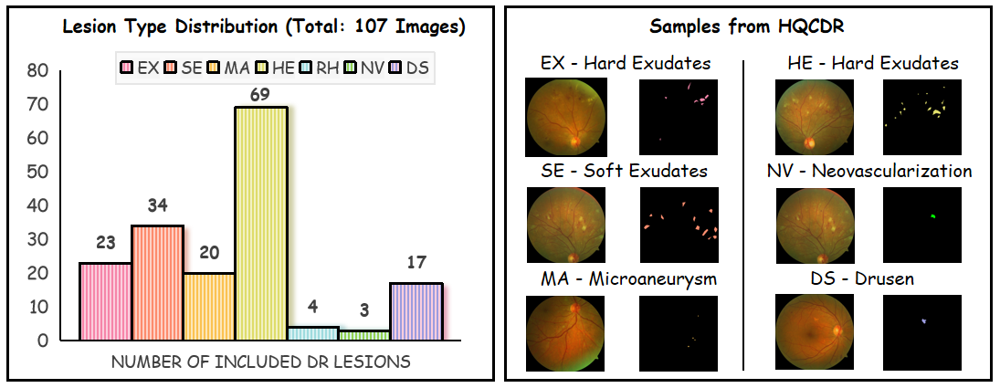

# HQCDR

## 🧑‍⚕ Origin of the Dataset

The **HQCDR** dataset was constructed by ophthalmologists, containing high-quality retinal fundus images with lesion-level annotations. 

## 📊 Dataset Overview

We provide a statistical overview of lesion types included in the **HQCDR** dataset, based on a subset of **107 annotated retinal images**. This analysis helps researchers understand the composition of the dataset and supports lesion-aware model development and evaluation.

**Included Lesion Types:**

- **MA** – Microaneurysm  
- **HE** – Hemorrhage  
- **EX** – Hard Exudates  
- **SE** – Soft Exudates  
- **RH** – Roth Spots  
- **NV** – Neovascularization  
- **DS** – Drusen

    
  </a>

This figure presents the distribution of diabetic retinopathy lesions across 107 annotated images in the HQCDR dataset, highlighting the prevalence of each lesion type. It also showcases representative examples and segmentation masks for lesions.

## 📥 Download HQCDR Dataset
The HQCDR dataset can be downloaded from [this link](https://drive.google.com/file/d/1368HgfogsjBzFa7DpF2mb20ScNaLlgSI/view?usp=drive_link).
